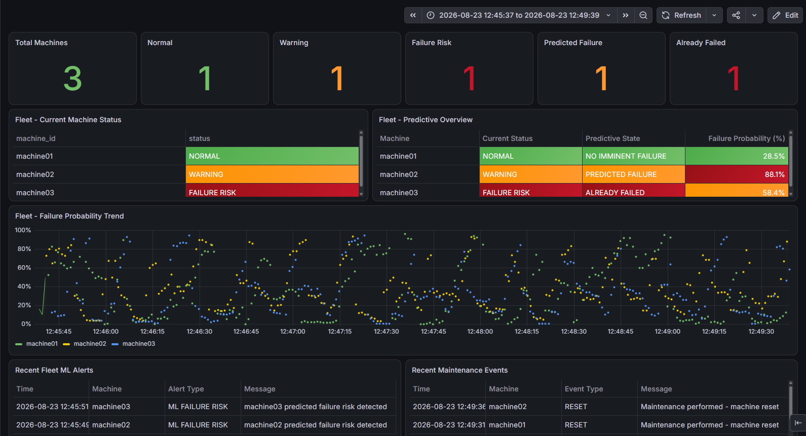
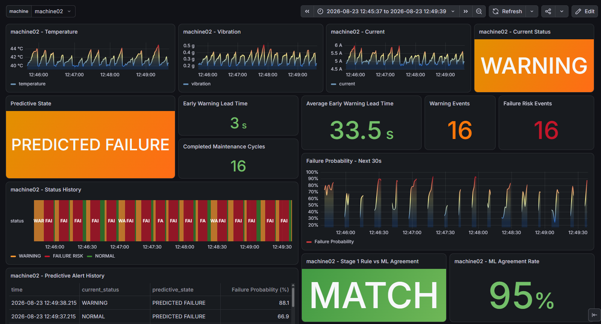

# Industrial IoT Predictive Maintenance System

An end-to-end Industrial IoT predictive maintenance project that simulates multiple industrial machines, streams sensor telemetry through MQTT, stores operational data in PostgreSQL, performs rule-based and machine-learning-based failure analysis, and visualizes fleet and machine-level behavior through Grafana dashboards.

The project is designed as a software-only simulation and does not require physical IoT hardware.

---

## Overview

Unexpected equipment failures can cause downtime, maintenance costs, and production losses in industrial environments.

This project demonstrates a complete predictive maintenance pipeline using simulated industrial machines.

Each machine continuously produces:

- Temperature
- Vibration
- Electrical current

The system processes these measurements through two complementary monitoring layers:

### Stage 1 - Rule-Based Monitoring

Sensor thresholds classify the current operational state of each machine as:

- `NORMAL`
- `WARNING`
- `FAILURE RISK`

### Stage 2 - Predictive Machine Learning

A trained Random Forest model estimates the probability of an upcoming failure and produces predictive states such as:

- `NO IMMINENT FAILURE`
- `PREDICTED FAILURE`
- `ALREADY FAILED`

The complete pipeline includes telemetry generation, MQTT communication, workflow automation, persistent storage, predictive analytics, maintenance/reset simulation, early-warning evaluation, and interactive monitoring dashboards.

---

## System Architecture

```text
┌──────────────────────────────┐
│ Python Machine Simulators    │
│ machine01 / 02 / 03          │
└──────────────┬───────────────┘
               │
               │ MQTT
               ▼
┌──────────────────────────────┐
│ Mosquitto MQTT Broker        │
└──────────────┬───────────────┘
               │
               ▼
┌──────────────────────────────┐
│ Node-RED                     │
│                              │
│ • Telemetry processing       │
│ • Status routing             │
│ • Alert handling             │
│ • Maintenance/reset logic    │
│ • ML integration             │
└───────┬──────────────────────┘
        │
        ├─────────────────────────────┐
        │                             │
        ▼                             ▼
┌───────────────────┐       ┌─────────────────────┐
│ PostgreSQL        │       │ Python ML Service   │
│                   │       │ Random Forest       │
│ • Sensor data     │       │ Failure Prediction  │
│ • Predictions     │       └─────────────────────┘
│ • ML alerts       │
│ • Maintenance     │
└─────────┬─────────┘
          │
          ▼
┌──────────────────────────────┐
│ Grafana                      │
│                              │
│ • Fleet Overview             │
│ • Machine Detail             │
│ • Failure Probability        │
│ • Status History             │
│ • ML Evaluation              │
└──────────────────────────────┘
```

---

## Main Features

### Multi-Machine IoT Simulation

The system simulates three independent industrial machines:

- `machine01`
- `machine02`
- `machine03`

Each machine generates changing sensor telemetry and progresses through different operational conditions.

The simulator produces realistic cycles of normal operation, degradation, warning conditions, failure risk, and maintenance resets.

---

### MQTT Communication

Machine telemetry and system events are exchanged using MQTT.

The project uses Mosquitto as the local MQTT broker and Node-RED as the main workflow and event-processing layer.

MQTT topics are used for:

- Sensor telemetry
- Machine status
- Alerts
- Maintenance/reset events
- ML predictions
- ML alerts

---

## Rule-Based Condition Monitoring

The first monitoring stage evaluates current sensor measurements using deterministic thresholds.

Example logic:

```text
NORMAL
    ↓
WARNING
    ↓
FAILURE RISK
```

The monitored variables are:

- Temperature
- Vibration
- Current

This layer represents conventional condition monitoring based on known operating limits.

---

## Machine Learning Failure Prediction

The second monitoring stage uses a Random Forest classifier trained on generated machine sensor data.

The model receives:

```text
temperature
vibration
current
```

and estimates failure risk before the rule-based system necessarily reaches its final failure state.

Predictive outputs include:

```text
NO IMMINENT FAILURE
PREDICTED FAILURE
ALREADY FAILED
```

A failure probability is also calculated and stored for monitoring and analysis.

This allows the system to demonstrate the main idea behind predictive maintenance: identifying elevated failure risk before conventional threshold-based monitoring alone indicates the final failure condition.

---

## Early Warning Evaluation

The project evaluates whether the predictive model detects failure before the corresponding simulated failure event.

For completed maintenance cycles, the system identifies:

```text
first PREDICTED FAILURE
        ↓
first ALREADY FAILED
        ↓
maintenance RESET
```

The difference between the predictive warning and failure timestamps is used to calculate the:

### Early Warning Lead Time

```text
Lead Time = Failure Time - Prediction Time
```

The Grafana dashboard displays both:

- Latest Early Warning Lead Time
- Average Early Warning Lead Time

This provides a measurable indication of how early the predictive layer identifies simulated failure conditions.

---

## Maintenance Cycle Simulation

Machines can enter failure conditions and later receive simulated maintenance.

A maintenance action generates a:

```text
RESET
```

event.

This starts a new operational cycle and allows the system to evaluate predictive performance across repeated degradation and maintenance episodes.

Maintenance events are stored in PostgreSQL and displayed in Grafana.

---

# Grafana Dashboards

Two dashboards provide fleet-level and machine-level observability.

---

## Fleet Overview

The Fleet Overview dashboard provides a high-level view of the complete simulated machine fleet.

It includes:

- Total machines
- Machines currently in `NORMAL`
- Machines currently in `WARNING`
- Machines currently in `FAILURE RISK`
- Machines with `PREDICTED FAILURE`
- Machines classified as `ALREADY FAILED`
- Current status for every machine
- Current predictive state
- Failure probability
- Fleet-wide failure probability trend
- Recent ML alerts
- Recent maintenance events

### Fleet Overview Screenshot



---

## Machine Detail Dashboard

The Machine Detail dashboard allows an individual machine to be selected using a Grafana variable.

Example:

```text
machine = machine02
```

The dashboard includes:

- Temperature history
- Vibration history
- Current history
- Current machine status
- Current predictive state
- Early Warning Lead Time
- Average Early Warning Lead Time
- Completed Maintenance Cycles
- Warning Events
- Failure Risk Events
- Status History
- Failure Probability trend
- Predictive Alert History
- Rule-Based vs ML agreement
- ML Agreement Rate

### Machine Detail Screenshot



---

## Rule-Based vs ML Agreement

The project also compares the traditional rule-based status with the ML-derived status.

The Machine Detail dashboard shows whether the latest predictions agree with the rule-based classification and calculates an overall agreement rate for the selected machine and time range.

This provides a simple way to inspect the relationship between deterministic monitoring and predictive classification.

---

# PostgreSQL Database

PostgreSQL provides persistent storage for telemetry, predictions, alerts, and maintenance events.

Main tables include:

### `sensor_readings`

Stores machine telemetry and current rule-based status.

Typical fields include:

```text
timestamp
machine_id
temperature
vibration
current
status
predicted_status
```

---

### `predictive_readings`

Stores ML prediction results.

Typical data includes:

```text
timestamp
machine_id
current_status
predictive_state
failure_probability
```

---

### `ml_alerts`

Stores predictive failure alerts generated by the ML layer.

---

### `maintenance_events`

Stores maintenance/reset events for each machine.

---

## Database Schema

The database structure and indexes are provided in:

```text
database/schema.sql
```

This allows the database structure required by the project to be recreated without manually defining every table.

---

# Project Structure

```text
predictive-maintenance/
│
├── database/
│   └── schema.sql
│
├── docs/
│   └── screenshots/
│       ├── fleet-overview-dashboard.png
│       └── machine-detail-dashboard.png
│
├── grafana/
│   ├── fleet-overview.json
│   └── machine-detail.json
│
├── ml/
│   ├── analyze_predictive_data.py
│   ├── analyze_training_data.py
│   ├── api.py
│   ├── evaluate_early_warning.py
│   ├── predict.py
│   ├── train_model.py
│   └── train_predictive_model.py
│
├── models/
│   ├── predictive_failure_model.pkl
│   └── random_forest_model.pkl
│
├── node-red/
│   └── flows.json
│
├── simulator/
│   ├── predictive_training_generator.py
│   ├── sensor_simulator.py
│   └── training_data_generator.py
│
├── data/
│   └── generated runtime/training datasets
│
├── .gitignore
├── requirements.txt
└── README.md
```

Generated CSV datasets are created locally and excluded from version control.

---

# Technology Stack

| Component | Technology |
|---|---|
| Programming | Python |
| IoT Messaging | MQTT |
| MQTT Broker | Mosquitto |
| Workflow Automation | Node-RED |
| Database | PostgreSQL |
| Visualization | Grafana |
| Machine Learning | scikit-learn |
| ML Algorithm | Random Forest |
| Data Processing | pandas |
| Version Control | Git / GitHub |

---

# Installation

## 1. Clone the Repository

```bash
git clone <repository-url>
cd predictive-maintenance
```

---

## 2. Create a Python Virtual Environment

### Windows

```powershell
python -m venv .venv
.venv\Scripts\Activate.ps1
```

### Linux / macOS

```bash
python3 -m venv .venv
source .venv/bin/activate
```

---

## 3. Install Python Dependencies

```bash
pip install -r requirements.txt
```

---

## 4. Install Mosquitto MQTT Broker

Install and start a local Mosquitto MQTT broker.

The Python simulator and Node-RED workflows use MQTT to exchange telemetry and system events.

---

## 5. Configure PostgreSQL

Create a PostgreSQL database for the project.

Then execute:

```text
database/schema.sql
```

using pgAdmin, or run it using the PostgreSQL command line:

```bash
psql -d <database_name> -f database/schema.sql
```

Update the database connection configuration in Node-RED and the relevant Python components if necessary.

---

## 6. Import the Node-RED Flow

Open Node-RED and import:

```text
node-red/flows.json
```

Configure the PostgreSQL connection node to use your local database.

Deploy the flow after configuration.

---

## 7. Import the Grafana Dashboards

Import:

```text
grafana/fleet-overview.json
grafana/machine-detail.json
```

Configure the PostgreSQL Grafana data source so the dashboards can query the project database.

---

# Running the System

The complete system requires the MQTT broker, Node-RED, PostgreSQL, ML service, and machine simulator to be running.

A typical startup sequence is:

### Terminal 1 - MQTT Broker

Start Mosquitto.

Example on Windows:

```powershell
mosquitto -v
```

---

### Terminal 2 - Node-RED

```powershell
node-red
```

Open Node-RED in the browser and make sure the project flow is deployed.

---

### Terminal 3 - ML API

With the Python virtual environment activated:

```powershell
python ml/api.py
```

---

### Terminal 4 - Machine Simulator

```powershell
python simulator/sensor_simulator.py
```

The simulator begins generating telemetry for the machine fleet.

---

## Open Grafana

Open Grafana and load:

```text
Predictive Maintenance - Fleet Overview
```

or:

```text
Predictive Maintenance - Machines
```

Select a suitable time range to inspect telemetry, predictions, maintenance cycles, and machine status changes.

---

# Example Predictive Maintenance Scenario

A typical simulated cycle can look like:

```text
Machine operating normally
        ↓
Sensor values begin degrading
        ↓
WARNING
        ↓
ML failure probability increases
        ↓
PREDICTED FAILURE
        ↓
FAILURE RISK
        ↓
ALREADY FAILED
        ↓
Maintenance RESET
        ↓
Machine returns to operation
```

This demonstrates how predictive monitoring can provide additional warning information before a simulated machine reaches its final failure condition.

---

# Data and Model Training

Training datasets are generated locally by the scripts inside:

```text
simulator/
```

The generated CSV files are excluded from Git because they can be recreated when required.

The trained model artifacts are stored in:

```text
models/
```

The project therefore keeps the reusable model artifacts while avoiding unnecessary generated dataset files in the repository.

---

# Limitations

This project is a software-based Industrial IoT simulation.

It does not currently use physical industrial sensors or real production machinery.

Important limitations include:

- Sensor telemetry is synthetically generated.
- Failure behavior is simulated.
- Model performance is evaluated on generated data.
- Maintenance events are simulated rather than triggered by real maintenance operations.
- The ML model has not been validated using a real industrial dataset.
- The system is intended as a portfolio and learning project rather than a production-ready industrial monitoring platform.

These limitations are intentional and keep the project reproducible without requiring specialized industrial hardware.

---

# Possible Future Improvements

Potential extensions include:

- Integration with physical IoT sensors
- Real industrial predictive-maintenance datasets
- Additional machine types
- More advanced time-series models
- Remaining Useful Life (RUL) estimation
- Automated model retraining
- Docker containerization
- Cloud deployment
- Authentication and role-based access
- Notification integrations
- Additional anomaly-detection algorithms
- Model performance monitoring
- Production-oriented API deployment

---

# What This Project Demonstrates

This project combines several areas of software engineering and data engineering in one end-to-end system:

- Python development
- IoT communication
- MQTT messaging
- Event-driven workflows
- PostgreSQL database design
- SQL analytics
- Machine learning
- Predictive maintenance concepts
- Grafana visualization
- Multi-machine monitoring
- Data pipeline integration
- Git-based project organization

Rather than demonstrating an isolated ML notebook or a standalone dashboard, the project connects the individual components into a complete simulated monitoring pipeline.

---

# Author

Developed as a portfolio project focused on:

**Industrial IoT, Software Engineering, Data Engineering, Machine Learning, and Predictive Maintenance.**